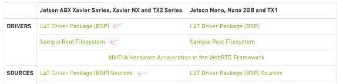
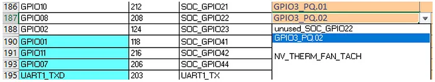
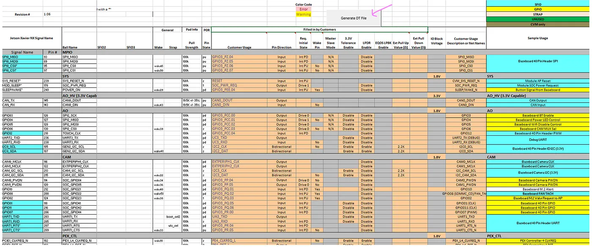
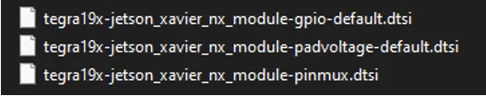

# Changing device tree and compiling Kernel for Nvidia Jetson Xavier NX
[reference](https://medium.com/@haoye94/editing-device-tree-and-compiling-kernel-for-nvidia-jetson-xavier-nx-11a1df20939c)

* Go to `/home/USER/projects` and create a folder to store all related files for the project.
  ```BASH
  cd $HOME/projects
  mkdir changing-device-tree-compiling-kernel
  ```
## Requirement
  ```BASH
  sudo apt install libssl-dev
  sudo apt-get install flex
  sudo apt-get install bison
  ```

## Compiler
On the host machine which is most likely an x86 architecture, we need to download the corresponding compiler and set it up for cross-compilation.  
NVIDIA recommends using the `Linaro 7.3.1 2018.05` toolchain for this. Download the pre-built toolchain binaries [here](http://releases.linaro.org/components/toolchain/binaries/7.3-2018.05/aarch64-linux-gnu/gcc-linaro-7.3.1-2018.05-x86_64_aarch64-linux-gnu.tar.xz), follow the next steps:[Reference](https://developer.ridgerun.com/wiki/index.php?title=Jetson_Nano/Development/Building_the_Kernel_from_Source)
* Go to `changing-device-tree-compiling-kernel` and download the compiler.
  ```BASH
  cd changing-device-tree-compiling-kernel
  wget http://releases.linaro.org/components/toolchain/binaries/7.3-2018.05/aarch64-linux-gnu/gcc-linaro-7.3.1-2018.05-x86_64_aarch64-linux-gnu.tar.xz
  ```
* Create the folder `l4t-gcc/` and unzip the compiler inside
  ```BASH
  mkdir l4t-gcc
  tar -xvf gcc-linaro-7.3.1-2018.05-x86_64_aarch64-linux-gnu.tar.xz -C l4t-gcc/
  ```
## NVIDIA files
Go to [Jetson Linux Archive](https://developer.nvidia.com/embedded/jetson-linux-archive) and find the proper version, then click to go to the downloaded page. There, download `Linux for Tegra BSP`, `BSP sources` and `sample root file system (RFS)`.

  *Note: Download the tree files inside folder `changing-device-tree-compiling-kernel/`*
  Download the files with the cli, doing right click and copying the link to download, as exmaple it is downloaded Jetson Linux 5.0.1
  ```BASH
  cd $HOME/projects/changing-device-tree-compiling-kernel/
  wget https://developer.nvidia.com/embedded/l4t/r35_release_v1.0/release/jetson_linux_r35.1.0_aarch64.tbz2
  wget https://developer.nvidia.com/embedded/l4t/r35_release_v1.0/release/tegra_linux_sample-root-filesystem_r35.1.0_aarch64.tbz2
  wget https://developer.nvidia.com/embedded/l4t/r35_release_v1.0/sources/public_sources.tbz2
  ```
* Extract Linux for Tegra from `Jetson_Linux_R35.1.0_aarch64.tbz2`
  ```BASH
  tar -xvf jetson_linux_r35.1.0_aarch64.tbz2
  ```
* Extract the `Sample_Root_Filesystem` inside the folder `Linux_for_Tegra/rootfs/` 
  ```BASH
  sudo tar -xvpf tegra_linux_sample-root-filesystem_r35.1.0_aarch64.tbz2 -C Linux_for_Tegra/rootfs/
  ```
In the *public_sources.tbz2* (BSP sources zip file), there will be many other zip files inside, but we are only interested in `kernel_src.tbz2`. Extract this file into a folder to named “source”
* Find the `kernel_src.tbz2` in *public_sources.tbz2*.
  ```BASH
  sudo tar -tf public_sources.tbz2
  ```
* Once the direccion of `kernel_src.tbz2` is found, extract from *public_sources.tbz2*(commonly located as follow)
  ```BASH
  sudo tar -xvpf public_sources.tbz2 Linux_for_Tegra/source/public/kernel_src.tbz2
  ```
* Extract the `kernel_src.tbz2` in `Linux_for_Tegra/source/`.
  ```BASH
  sudo tar -xvpf Linux_for_Tegra/source/public/kernel_src.tbz2 -C Linux_for_Tegra/source/
  ```
Create `extlinux.conf`
*  create a directory called `extlinux/` in `Linux_for_Tegra/rootfs/boot/` and create `extlinux.conf`
  ```BASH
  sudo mkdir Linux_for_Tegra/rootfs/boot/extlinux/
  sudo touch Linux_for_Tegra/rootfs/boot/extlinux/extlinux.conf
  ```
* Open `extlinux.conf` and copy the next content.
  ```BASH
  sudo vim touch Linux_for_Tegra/rootfs/boot/extlinux/extlinux.conf 
  ```
  content:   
  ```BASH
  TIMEOUT 30
  DEFAULT primary
  MENU TITLE L4T boot options
  LABEL primary
  MENU LABEL primary kernel
  LINUX /boot/Image
  INITRD /boot/initrd
  APPEND ${cbootargs} root=/dev/mmcblk1p1 rw rootwait rootfstype=ext4 console=ttyS0,115200n8 console=tty0 fbcon=map:0 net.ifnames=0
  ```
## Change Pinmux
If the pin functions defer from dev kit, changes to pinmux are most likely required. This step can only be done on windows since it makes use of Excel Macros

Download [pinmux excel file](./docs/Jetson_Xavier_NX_Pinmux_Configuration_Template_v1.06%20.xlsm).
Editing the excel file is pretty straightforward, edit the orange area.

Once done with your changes, click on the “Generate DT File” button, give your board a name. and you should see 3 files generated in the same folder.

There should be 3 files generated in the same folder. Copy these files to your Ubuntu machine in the folder `changing-device-tree-compiling-kernel`. 

## Generate .cfg files
The script to generate from .dtsi to .cfg files are located in: `Linux_for_Tegra/kernel/pinmux/t19x/ pinmux-dts2cfg.py`
* Copy the files into the same folder as the script
  ```BASH
  cp *.dtsi Linux_for_Tegra/kernel/pinmux/t19x/
  ```
* Run the `pinmux-dts2cfg.py` script
  ```BASH
  cd Linux_for_Tegra/kernel/pinmux/t19x/
  python3 pinmux-dts2cfg.py --pinmux addr_info.txt gpio_addr_info.txt por_val.txt --mandatory_pinmux_file tegra19x-jetson_xavier_nx_module-pinmux.dtsi tegra19x-jetson_xavier_nx_module-gpio-default.dtsi 1.0 > tegra19x-mb1-pinmux-p3668-a01.cfg
  python pinmux-dts2cfg.py --pad pad_info.txt tegra19x-jetson_xavier_nx_module-padvoltage-default.dtsi  1.0 > tegra19x-mb1-padvoltage-p3668-a01.cfg
  ```
Note: on the first execution of `pinmux-dts2cfg.py` would be a warning, but if the `tegra19x-mb1-pinmux-p3668-a01.cfg` is generated, is all fine. Example of the warning:

Replace the files `*.cfg` generated in `Linux_for_Tegra/bootloader/t186ref/BCT/`
* Rename the files `*.cfg`
  ```BASH
  mv tegra19x-mb1-padvoltage-p3668-a01.cfg tegra19x-mb1-padvoltage-p3668-a01.cfg.new
  mv tegra19x-mb1-pinmux-p3668-a01.cfg tegra19x-mb1-pinmux-p3668-a01.cfg.new
  ```
* copy the new files to  `Linux_for_Tegra/bootloader/t186ref/BCT/`
  ```BASH
  cp *.cfg.new ../../../bootloader/t186ref/BCT/
  ```
* Go to `Linux_for_Tegra/bootloader/t186ref/BCT/` and check the relevant files
  ```BASH
  cd ../../../bootloader/t186ref/BCT/
  ls | grep p3668-a01.cfg
  ```
* Replace the new files
  ```BASH
  mv tegra19x-mb1-padvoltage-p3668-a01.cfg.new tegra19x-mb1-padvoltage-p3668-a01.cfg
  mv tegra19x-mb1-pinmux-p3668-a01.cfg.new tegra19x-mb1-pinmux-p3668-a01.cfg
  ```
## Build kernel and device tree
Return to the working directory
  ```BASH
  cd ../../../../
  ```
NVIDIA has provided a build script to build the kernel and device tree, at:
Edit the file `nvcommon_build.sh`, at line 29, erase the word `-buildroot`
* Open the file `nvcommon_build.sh`
  ```BASH
  sudo vim Linux_for_Tegra/source/nvcommon_build.sh
  ```
* Press `i` and erase the word
  
* Pres `Esc` and write `:wq` to save the changes
Set environment variable for compiler path:
  ```BASH
  export CROSS_COMPILE_AARCH64_PATH="/home/lubuntu/Projects/Change_Device_Tree_Jetson/l4t-gcc/gcc-linaro-7.3.1-2018.05-x86_64_aarch64-linux-gnu"
  ```
  *Note: the full path to the folder `gcc-linaro-7.3.1-2018.05-x86_64_aarch64-linux-gnu` in the export variable may vary on your computer.*
Build the kernel
  ```BASH
  ./Linux_for_Tegra/source/nvbuild.sh -o ~/Projects/Change_Device_Tree_Jetson/kernel_out/
  ```
## Replace .dtb files


## Flash device tree
